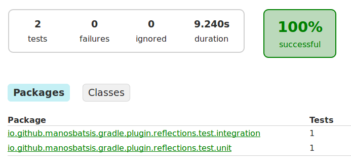

# Gradle Reflections Plugin [](https://travis-ci.org/manosbatsis/gradle-reflections-plugin)

The plugin uses [Reflections](https://github.com/ronmamo/reflections) to scan and index your project classes 
at build-time, allowing run-time querying without the indexing performance hit.


<!-- TOC depthFrom:2 depthTo:6 withLinks:1 updateOnSave:1 orderedList:0 -->

- [Usage](#usage)
	- [Gradle](#gradle)
	- [Java](#java)
- [Development](#development)
	- [Quickstart](#quickstart)
	- [Tests](#tests)

<!-- /TOC -->

## Usage

The idea is to use the plugin with Gradle to embed a pre-scanned metadata index in your jar,
then utilise the embedded index at ruintime using Reflections.collect(). See the Gradle and Java sections bellow  
for an example.   

### Gradle

The plugin is published in [Gradle plugin portal](https://plugins.gradle.org/plugin/io.github.manosbatsis.gradle.plugin.reflections),
so it is rather easy to use. This will add the pre-scanned
metadata index in your jar as `META-INF/reflections/PROJECTNAME-reflections.xml`, with
*PROJECTNAME* substituted by your actual project name.

```gradle
// import the reflections plugin
plugins {
	id "io.github.manosbatsis.gradle.plugin.reflections" version "1.1"
}

// you probably need this...
apply plugin: 'java'

// reflections plugin needs the compiled
// project classes, so either chain tasks
// with dependsOn as bellow or execute tasks explicitly
// when using the command line
reflections{
    dependsOn classes
}
jar{
    dependsOn reflections
}


// Use jcenter for resolving your dependencies.
repositories {
	jcenter()
}

// Add Reflections and dom4j dependencies
dependencies {
	compile 'org.reflections:reflections:0.9.10'
	compile 'dom4j:dom4j:1.6.1'
	testCompile 'junit:junit:4.12'
}
```

### Java

To utilise the pre-scanned index simply create a Reflections instance as:

```java
// Collect and merge pre-scanned Reflection xml resources
// and merge them into a Reflections instance
Reflections reflections = Reflections.collect();
// use the instance, e.g.
reflections.getSubTypesOf(Foobar.class);
```

## Development

**You don't need this to use the plugin**. This section is meant for developers that want to build the plugin code themselves.

### Quickstart

This section assumes you have a JDK and a recent Gradle installed and available in your path.

Clone:

```
git clone https://github.com/manosbatsis/gradle-reflections-plugin.git
```

Build:

```
gradle build
```

### Tests

The build has some [unit](src/test/java/io/github/manosbatsis/gradle/plugin/reflections/test/unit/ReflectionsPluginTest.java) 
and [integration](src/test/groovy/io/github/manosbatsis/gradle/plugin/reflections/test/integration/SimpleProjectIT.groovy) 
tests. The build creates the report at `build/reports/tests/test/index.html`:


